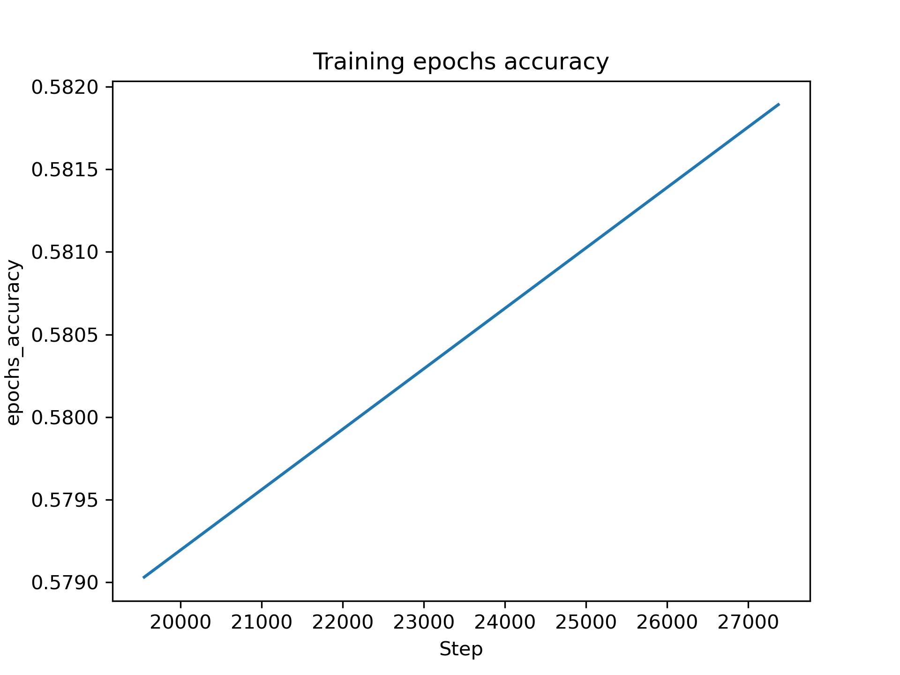

# Project Inrtroduction

In this project, I will demonstrate how to fine-tune an image classification model using ResNet-34, a widely-used deep learning architecture for image-related tasks. ResNet-34 is known for its effectiveness in handling complex image data through its residual learning framework, making it a popular choice for image classification tasks. The dataset I will use for this demonstration is CIFAR-100, which consists of 100 classes of images, providing a challenging and diverse set of samples for training and evaluation.
<br/>

# Project Setup Instructions

This project will use Jupyter Notebook (Python3) for running the code, and the training and inference of the model will be performed on the SageMaker platform. You can upload the Jupyter notebook file to a SageMaker JupyterLab or Notebook instance, or you can run it on your local machine or EC2 instance ( In that case, you may not be able to use the sagemaker.get_execution_role() function. Instead, you should hard-code the ARN of the role you create.)

Regardless of where you run the code, you will need to prepare an IAM role with permissions for both Amazon S3 and SageMaker.
<br/>

# Project Structure

This project contains four code files:

| file name | description |
| ---------- | ---------- |
| train_and_deploy.ipynb | The Jupyter notebook used to prepare the data, train the model, perform hyperparameter tuning, and deploy the model. |
| hpo.py | The Python script used for hyperparameter optimization (HPO). |
| train_model.py | The Python script used to train the model. This file is similar to hpo.py, with the primary difference being that it includes additional code for SageMaker Debugger and Profiler, which are not present in hpo.py|
| inference.py | The entry point for the SageMaker endpoint. Since we deploy a custom-trained model, this script helps process the input data, execute predictions, and send the response|
<br/>

# Model Insights

This model demonstrates a fine-tuned version of ResNet-34 for image classification using the CIFAR-100 dataset. The training and evaluation process is monitored using SageMaker Debugger, which captures metrics such as batch loss, batch accuracy, epoch loss, and epoch accuracy. 
And the insights are as follow: 

| Item | Description |
| --------------- | ---------- |
| Model Design | ResNet-34 with an additional fully connected (fc) layer. Residual blocks 1 to 3 of the pretrained ResNet-34 are frozen. |
| Training Data | CIFAR-100 train dataset, which contains 50,000 images across 100 classes |
| Test Data | CIFAR-100 test dataset, which contains 10,000 images across 100 classes |
| Hyperparameters | For the demo, we tuned three hyperparameters: learning_rate, batch_size, and epochs 10 times. The best hyperparameter set found was {'learning_rate': 0.017483127170473314, 'batch_size': 128, 'epochs': 70} |
| Training Instance Type | ml.p3.2xlarge (1 NVIDIA Tesla V100 and 8 CPUs) |
| Loss at Final Epoch | 1.5454 |
| Final Training Accuracy | 58.19% |
| Final Validation Accuracy | 40.71% |
<br/>

# Future Improvement
<div style="display: flex;" align="center">
 
 
</div>

Based on the batch training loss and accuracy above, in order to improve the model performance we can implement:
 - Data Augmentation:  
   - The training accuracy fluctuates around 60%-70%, suggesting potential overfitting or poor generalization. Additionally, the training loss has stabilized around 1.5–2.0, but it does not improve further.  
   - Data augmentation can increase the diversity of training samples, helping the model generalize better to unseen data and improving overall accuracy.

 - Fine-Tune Hyperparameters:  
   - Both the loss and accuracy curves show noisy behavior, which suggests that the learning rate might be too high or the batch size too small.  
   - Fine-tuning these hyperparameters can help stabilize the training process.

- Preprocessing and Normalization:  
   - ResNet-34 expects input images to be normalized with ImageNet statistics and resized to 224x224. However, the current dataset uses 32x32 images, which may degrade performance.  
   - Resizing the images and ensuring proper normalization can improve feature extraction and model accuracy.
<br/>

# Model Query

To make prediction, you need to pass a json format payload with a image data that decode by based64, suppose the image is in s3 ,you can use the sample code as bellow:

 ```python
# You should import necessary libraries like boto3, base64 and json

# Initialize SageMaker and S3 client
sagemaker_runtime = boto3.client('sagemaker-runtime')
s3_client = boto3.client('s3')

# load image from s3
image_data = (s3_client.get_object(Bucket=default_bucket, Key="test/bike_s_000457.png"))['Body'].read()

# Encode the image data as Base64 and convert the payload dictionary to a JSON string
payload = {"image": base64.b64encode(image_data).decode('utf-8')}
payload_json = json.dumps(payload)

# Invoke the SageMaker endpoint for inference
response = sagemaker_runtime.invoke_endpoint(
    EndpointName=predictor.endpoint_name,  # The name of the SageMaker endpoint
    ContentType='application/json',        # Must specify the content type
    Body=payload_json                      # Pass the JSON payload as the request body
)
```
<br/>

# About Sagemaker Debugger

SageMaker Debugger is a powerful tool that can help us debug the model training process. It allows us to use methods like `hook.save_tensor()` to save specific tensors, monitor their changes during training and understand the internal workings of the training process.

For example, in the training code of this project, I use `hook.save_tensor()` to track:  
- batch_loss
- batch_accuracy  
- epochs_accuracy  
- epochs_loss  

```python
def train(model, train_loader, criterion, optimizer, device, epochs, hook):
    model.train()
    hook.set_mode(smd.modes.TRAIN)

    for e in range(epochs):
        running_loss = 0
        correct = 0
        total = 0
        for data, target in train_loader:
            data = data.to(device)
            target = target.to(device)

            optimizer.zero_grad()
            pred = model(data)
            loss = criterion(pred, target)

            hook.save_tensor("batch_loss", loss)
            accuracy = (pred.argmax(dim=1) == target).float().mean().item()
            hook.save_tensor("batch_accuracy", torch.tensor(accuracy))

            running_loss += loss.item()
            loss.backward()
            optimizer.step()

            pred = pred.argmax(dim=1, keepdim=True)
            correct += pred.eq(target.view_as(pred)).sum().item()
            total += target.size(0)
        hook.save_tensor("epochs_accuracy", torch.tensor(correct / total))
        hook.save_tensor("epochs_loss", torch.tensor(running_loss / len(train_loader)))
        print(f"Epoch {e}: Loss {running_loss / len(train_loader)}, Accuracy {100 * correct / total}%")
```

Although the SageMaker Debugger is powerful, we need to use it carefully; otherwise, it may produce abnormal outputs.
For example, if we display the epochs_accuracy data in the code above, we will get an image as bellow:

<div style="display: flex;" align="center">
 
</div>

Compared to the batch_loss.png and batch_accuracy.png above, it is clear that the debugger does not track the epochs_accuracy changes as expected. This issue may have several causes. To identify the root cause, we can:

 - Check CloudWatch logs: AWS generates logs for every training job and saves them to CloudWatch. By reviewing these logs, we can determine if any errors occurred during the training process that might have affected data collection. This helps identify potential issues and troubleshoot problems more effectively.
<div style="display: flex;" align="center">
 
</div>

 - Verify the data points: Ensure that the collected data points are accurate and correctly recorded.
   - Use `trial.tensor_names()` to check if the metric is being tracked. If the metric is listed, use `trial.tensor('epochs_accuracy').value(step)`
to see how many data points have been recorded. In this case, only two data points were recorded.

 - Check the debugger configuration: Double-check the debugger settings to confirm that the epochs_accuracy metric is being tracked correctly.
   - In this project, the configuration is set as `hook_parameters={"train.save_interval": "50", "eval.save_interval": "10"}`. This means that during the training process, for epoch-level metrics, the debugger will record one data point every 50 epochs. Since the total number of epochs in this project is 70, only two data points will be recorded. This explains why the resulting image appears as a straight line.

<br/>

# Other Porject Image
<div style="display: flex;" align="center">
 
</div>
<div style="display: flex;" align="center">
 
</div>
<div style="display: flex;" align="center">
 
</div>
